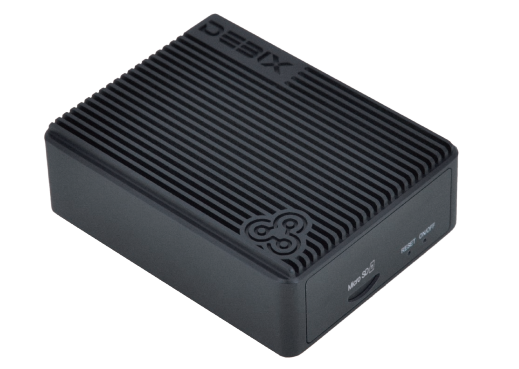
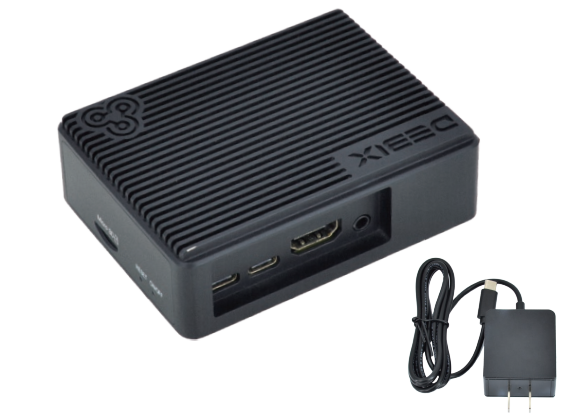
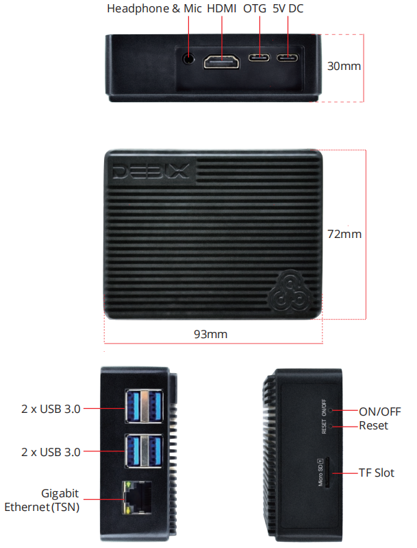

# DEBIX BPC-iMX8MP-01 Industrial Computer

## Overview
BPC-iMX8MP-01 is a fanless mini box pc utilizing DEBIX Model A or DEBIX Model B SBC for default, and it supports adding an 4G add-on board or a PoE module for the DEBIX
SBC inside. With a 5V DC power adapter and a Micro SD card pre-installed with the image (eMMC optional), it's an easy to use computer. Insert the Micro SD card, connect the display, power it on and press the ON/OFF button, then you can see the startup screen.

## Main Features
- Compact size, durable aluminum alloy case
- Fanless design with increased surface area for enhanced heat dissipation
- Gigabit network and four USB 3.0 to bring an efficient data transmission speed
- 1 x HDMI at 3840 x 2160p30, 1 x 3.5mm headphone and mic combo
- Support Wi-Fi antenna by removing the plastic baffle at the right side

## Specification
| System          |       |
|-----------------|-------|
| Motherboard | DEBIX Model A or DEBIX Model B  |
| Memory          | 2GB LPDDR4 (1GB/4GB/8GB optional)  |
| Storage         | Micro SD card (Onboard 8GB/16GB/32GB/64GB/128GB/256GB eMMC optional)  |
| OS              | Ubuntu 22.04, Yocto-L6.6.36, Win10 IoT Enterprise, Android 11, Debian 12 (also supports OpenWRT and FreeRTOS) *Note: 4GB/8GB RAM required for Win10 IoT, and 8GB RAM is recommended*  |
|**I/O Interface**|
| Network         | 1 x Gigabit Ethernet, supports TSN and POE power supply (need POE power device module), 2.4GHz & 5GHz Wi-Fi5, Bluetooth 5.0 |
| USB Type-C      | 1 x Type-C USB for DC 5V power input 1 x Type-C USB as a USB OTG |
| USB 3.0         | 4 x USB 3.0 Host |
| HDMI            | 1 x Type-A HDMI output, 3840 x 2160p30 |
| Audio           | 1 x 3.5mm Headphone and Mic combo port |
| Slot           | 1 x Micro SD card slot |
| KEY             | 1 x RESET KEY 1 x ON/OFF KEY |
|**Mechanical & Environmental**|
| Material    | Aluminum alloy  |
| Dimension   | 93.0mm × 72.0mm x 30.0mm (±0.5mm)  |
| Net Weight      | 190g (±0.5g)  |
| Gross Weight    | 211g (±0.5g)  |
| Operating Temp. | -20°C to 70°C (DEBIX Model A), -40°C to 85°C (DEBIX Model B)  |
|**Power Supply**|
| Power Adapter   | DC 5V/3A via Type-C |

## I/O Interfaces and Dimension:

## Ordering Codes
| RAM LPDDR4  | eMMC Storage | PN for BPC-iMX8MP-01 -20°C to 70°C | PN for BPC-iMX8MP-01 -40°C to 85°C |
|-------------|--------------|----------------|---------------------|
| **1GB DDR** | Lite | BPC-iMX8MP-01-D1E0    |   |
|             | 8GB   | BPC-iMX8MP-01-D1E8    | BPC-iMX8MP-01-I-D1E8 |
|             | 16GB  | BPC-iMX8MP-01-D1E16   | BPC-iMX8MP-01-I-D1E16 |
|             | 32GB  | BPC-iMX8MP-01-D1E32   | BPC-iMX8MP-01-I-D1E32 |
|             | 64GB  | BPC-iMX8MP-01-D1E64   | BPC-iMX8MP-01-I-D1E64 |
| **2GB DDR** | Lite | BPC-iMX8MP-01-D2E0|   |
|             | 8GB   | BPC-iMX8MP-01-D2E8    | BPC-iMX8MP-01-I-D2E8 |
|             | 16GB  | BPC-iMX8MP-01-D2E16   | BPC-iMX8MP-01-I-D2E16 |
|             | 32GB  | BPC-iMX8MP-01-D2E32   | BPC-iMX8MP-01-I-D2E32 |
|             | 64GB  | BPC-iMX8MP-01-D2E64   | BPC-iMX8MP-01-I-D2E64 |
| **4GB DDR** | Lite | BPC-iMX8MP-01-D4E0|   |
|             | 8GB   | BPC-iMX8MP-01-D4E8    | BPC-iMX8MP-01-I-D4E8 |
|             | 16GB  | BPC-iMX8MP-01-D4E16   | BPC-iMX8MP-01-I-D4E16 |
|             | 32GB  | BPC-iMX8MP-01-D4E32   | BPC-iMX8MP-01-I-D4E32 |
|             | 64GB  | BPC-iMX8MP-01-D4E64   | BPC-iMX8MP-01-I-D4E64 |
| **8GB DDR** | Lite | BPC-iMX8MP-01-D8E0|    |
|             | 8GB   | BPC-iMX8MP-01-D8E8    |    |
|             | 16GB  | BPC-iMX8MP-01-D8E16   |    |
|             | 32GB  | BPC-iMX8MP-01-D8E32   |    |
|             | 64GB  | BPC-iMX8MP-01-D8E64   |    |

## Compatible with DEBIX's Accessories
| Product                     | Model               |
|-----------------------------|---------------------|
| 4G Board                   | EMB-AS-05          |
| SBC POE Board              | EMB-AS-06          |
| DEBIX Display Screens      | DEBIX TD050H; DEBIX TD070H; DEBIX TD101H |

## Safety Instructions and Warnings:
- Disconnect the device from the DC power supply before cleaning. Use a damp rag. Do not use liquid detergents or spray-on detergents.
  
- Keep the device away from moisture.

- During installation, put the device on a reliable table. It will be damaged if you drop it.

- Before connecting the power supply, ensure that the voltage is in the required range.

- Put the power cable in place to avoid stepping on it.

- If the device is not used for a long time, power it off to avoid damage caused by sudden overvoltage.

- For safety reasons, the device can only be disassembled by professional personnel.

- Do not place the device in a place where the ambient temperature is below -40℃ or above 85℃. This will damage the machine. It needs to be kept in an environment at controlled temperature.

## Contact Us
- **Headquarters**: DEBIX Technology Inc., 8345 Gold River Ct., Las Vegas, NV 89113, USA  
- **Factory**: 5-6/F., East Zone, Shunheda A2 Building, Liqxiandong Industrial Park, XiLi, Nanshan Dist., Shenzhen, China  
- **Email**: info@debix.io  
- **Website**: [www.debix.io](https://www.debix.io)  
- **Community**: [Discord](https://discord.com/invite/adaHHaDkH2)